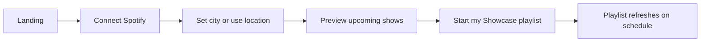
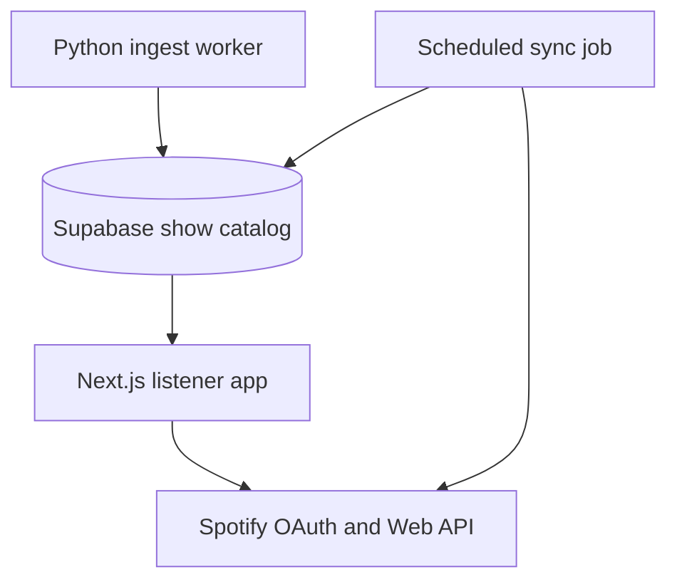

# Showcase Listener Web App

Product brief for a standalone web app where Spotify listeners connect their account, pick a city (or use location), preview upcoming local acts, and receive a **living playlist** that refreshes on a schedule.

**Branch:** `planning/ui-and-features`  
**Launch city:** Toronto (existing venue scraper)  
- Deferred: [`docs/deferred-implementation.md`](deferred-implementation.md)

---

## Product summary

**Showcase** answers: *“Who is playing near me soon, and can I hear them on Spotify?”*

Users visit the site, sign in with Spotify, set a place, preview shows pulled from a shared catalog, and start one playlist per city that **updates in place** as new gigs appear and old ones pass.

Artist promo embeds are out of scope for v1. The same catalog can power them later.

---

## v1 user flow

### 1. Landing

- One headline, one subline, one primary button: **Connect with Spotify**.
- Dark, editorial aesthetic — sparse layout, large type, poster/ticket energy.
- No dashboard chrome, no feature grid.

### 2. Place

- **Use my location** (browser geolocation) with manual city search fallback.
- Resolve geolocation to nearest supported city (lat/lng → city record).
- If the city is **not ingested yet**, show a clear “coming soon” state and optional waitlist — never an empty playlist with no explanation.

### 3. Preview

- Read-only cards from the show catalog: artist image, name, venue, date/time.
- Default window: next **30 days**, **headliners only**.
- Small toggles: include openers, tracks per artist (1–3).

### 4. Start playlist

- One playlist per user per city, named **`Showcase · {City}`** (e.g. `Showcase · Toronto`).
- Private by default.
- On first run: create playlist and populate tracks.
- On subsequent syncs: **replace** track list in place (see [Playlist sync](#playlist-sync)).

### 5. Living status

- Last synced timestamp.
- Next scheduled refresh.
- **Pause updates** toggle (subscription stays; cron skips paused users).

---

## Architecture

Split **catalog** (shared, city-scoped shows) from **subscription** (per-user playlist config and tokens).

| Layer | Responsibility | Technology |
|-------|----------------|------------|
| **Ingest worker** | Scrape venue pages, LLM extract, Spotify match, upsert catalog | Existing Python pipeline ([`EventScraper`](../showcase/event_scraper/event_scraper.py), [`ShowFormatter`](../showcase/show_formatter/show_formatter.py)) |
| **Show catalog** | City-scoped upcoming shows; web app read-only | Supabase Postgres — schema in [`supabase/migrations/001_listener_web_app.sql`](../supabase/migrations/001_listener_web_app.sql) |
| **Web app** | UI, Spotify login (Auth Code + PKCE), preview, start/pause | Next.js on Vercel (deferred) |
| **Sync job** | For each active subscription: query catalog → build track list → replace playlist items | Python worker or Vercel cron calling shared sync logic |

**Rule:** Do **not** call the LLM scraper from the browser or per user request. Ingest runs on a schedule (e.g. daily for Toronto venues).

---

## Catalog vs subscription

### Catalog (shared)

- One row per **show** (single artist performance at a venue).
- Populated by the ingest worker; consumed by preview UI and sync job.
- Keyed by `city_id` + `show_start_time` + `artist_uri` (unique constraint prevents duplicates).

### Subscription (per user)

- Links a Spotify user to a city and a **single playlist ID**.
- Stores refresh token (encrypted), sync preferences, pause flag, last sync metadata.
- Sync job iterates active subscriptions; web app never writes to the catalog.

---

## Location and city coverage

### Launch: Toronto

Use the existing venue list in [`showcase/pipelines/constants/venues.py`](../showcase/pipelines/constants/venues.py). Ingest worker writes to `shows` with `city_id` pointing at the Toronto `cities` row.

### Expansion: listings API

“Any city the user types” requires a listings source keyed by lat/lng or city name. Venue HTML scraping does not scale globally.

**Recommended hybrid:**

1. **Toronto** — high-quality venue scraper (current pipeline).
2. **Other cities** — Ticketmaster Discovery API (or Bandsintown/Songkick if licensed). Map API events → Spotify artists → same `Show` / catalog row shape.
3. **UI** — location picker from day one; unsupported cities → waitlist / “coming soon”, not a silent empty playlist.

Without a listings API, geolocation search is a facade over ingested cities only. The UI must state supported cities explicitly.

---

## Data model

Full DDL: [`supabase/migrations/001_listener_web_app.sql`](../supabase/migrations/001_listener_web_app.sql).

### `cities`

| Column | Type | Notes |
|--------|------|-------|
| `id` | uuid PK | |
| `slug` | text unique | e.g. `toronto` |
| `name` | text | Display name |
| `country_code` | text | e.g. `CA` |
| `lat`, `lng` | float | For geolocation resolution |
| `timezone` | text | e.g. `America/Toronto` |
| `is_supported` | boolean | false → show “coming soon” |
| `ingest_source` | text | `venue_scraper` \| `ticketmaster` |

### `shows` (replaces ad-hoc `toronto_shows`)

| Column | Type | Notes |
|--------|------|-------|
| `id` | uuid PK | |
| `city_id` | uuid FK → cities | |
| `band_name` | text | Display name |
| `artist_uri` | text | Spotify artist URI |
| `venue` | text | |
| `show_start_time` | timestamptz | |
| `show_order` | text | `HEADLINER`, `OPENER`, etc. |
| `source_event_id` | text nullable | Upstream id for dedup |
| `ingested_at` | timestamptz | |

Unique: `(city_id, show_start_time, artist_uri)`.

### `user_subscriptions`

| Column | Type | Notes |
|--------|------|-------|
| `id` | uuid PK | |
| `spotify_user_id` | text unique | |
| `city_id` | uuid FK → cities | |
| `playlist_id` | text nullable | Set on first sync |
| `refresh_token_encrypted` | text | App-level encryption |
| `tracks_per_artist` | int default 2 | 1–3 |
| `include_openers` | boolean default false | |
| `lookahead_days` | int default 30 | |
| `sync_cadence_hours` | int default 24 | |
| `paused` | boolean default false | |
| `last_synced_at` | timestamptz nullable | |
| `last_sync_status` | text nullable | `ok`, `error`, `no_shows` |
| `last_sync_error` | text nullable | |

Unique: `(spotify_user_id, city_id)` — one subscription per user per city.

### `city_waitlist`

| Column | Type | Notes |
|--------|------|-------|
| `id` | uuid PK | |
| `email` | text | Optional |
| `requested_city` | text | Free text or geo label |
| `lat`, `lng` | float nullable | |
| `created_at` | timestamptz | |

---

## Playlist sync

Detailed algorithm: [`docs/playlist-sync.md`](playlist-sync.md).

Python implementation: [`showcase/playlist_creator/playlist_creator.py`](../showcase/playlist_creator/playlist_creator.py) — `sync_playlist()` and `collect_track_uris_from_shows()`.

**Principles:**

1. **Update in place** — use Spotify `PUT /playlists/{id}/tracks` (via `playlist_replace_items`), not create-a-new-playlist every run.
2. **Idempotent** — same catalog input → same track order; safe to re-run on cron.
3. **Per-user tokens** — sync job uses stored refresh token for that subscription (web OAuth flow stores it on subscribe).
4. **Skip when paused** — cron respects `user_subscriptions.paused`.
5. **Empty catalog** — replace playlist with empty list or leave unchanged + set `last_sync_status = no_shows` (document choice in sync job; prefer replace with empty to reflect “nothing upcoming”).

### Track selection (default)

1. Query `shows` for subscription’s `city_id` where `show_start_time` ∈ [now, now + `lookahead_days`].
2. Filter to headliners unless `include_openers`.
3. Sort by `show_start_time` ascending.
4. For each show with `artist_uri`, fetch top `tracks_per_artist` tracks (Spotify artist top tracks).
5. Deduplicate track URIs while preserving show order.
6. Replace all items in `playlist_id`.

### Playlist naming

- First create: `Showcase · {City name}`.
- Do not append dates to the name on sync (unlike the CLI’s dated names).

---

## Ingest worker (Toronto v1)

Scheduled job (cron / GitHub Actions / Supabase Edge + external runner):

1. Run existing scrape → format pipeline for `VENUES` (or `VENUES_TEST` in dev).
2. Map each `Show.as_dict()` to a catalog row with `city_id = toronto`.
3. **Upsert** into `shows` (do not `replace_table` on the whole table — allows multi-city catalog).
4. Optionally delete shows in the past or mark stale rows.

Migrate from [`load_shows.py`](../showcase/pipelines/load_shows.py) (`replace_table` on `toronto_shows`) to city-scoped upsert when implementing ingest.

---

## v1 features (in scope)

- [ ] Spotify connect / disconnect (web OAuth)
- [ ] City via geolocation or search
- [ ] Upcoming-show preview (read catalog)
- [ ] Create or attach one living playlist; scheduled replace-sync
- [ ] Headliner vs all acts; tracks per artist
- [ ] Pause updates; last-synced status

## Explicitly later

- Artist promo embed / plugin
- Multi-city playlists, genre filters, discovery (“artists I don’t know”)
- Ticket links, maps, follow artist
- Public share pages
- Global city coverage via scrape-only (without listings API)

---

## Deferred implementation

The following are **not** built on `planning/ui-and-features`. See [`docs/deferred-implementation.md`](deferred-implementation.md) for the full checklist.

| Item | Notes |
|------|-------|
| Next.js app shell | App Router, dark editorial UI, landing → auth → place → preview → start |
| Spotify web OAuth | Authorization Code + PKCE; scopes: `playlist-modify-private`, `user-read-private`; store refresh token encrypted in `user_subscriptions` |
| Supabase client in web | Read `cities`, `shows`; RLS policies for public read on catalog, user-scoped subscriptions |
| Vercel deployment | Env: `SPOTIFY_CLIENT_ID`, `SPOTIFY_CLIENT_SECRET`, `SUPABASE_URL`, `SUPABASE_SERVICE_KEY`, token encryption key |
| Sync cron | Vercel Cron or external worker invoking Python/TS sync for all non-paused subscriptions |
| Toronto ingest cron | Daily run of venue scraper → upsert `shows` |
| Geolocation → city | Reverse geocode or nearest `cities` row by lat/lng |
| Listings API adapter | Ticketmaster (or similar) for non-Toronto cities |

**Ready on this branch:** product brief, Supabase schema SQL, playlist sync spec, Python `sync_playlist()` for workers and tests.

---

## Related files

- Schema: [`supabase/migrations/001_listener_web_app.sql`](../supabase/migrations/001_listener_web_app.sql)
- Sync spec: [`docs/playlist-sync.md`](playlist-sync.md)
- Playlist logic: [`showcase/playlist_creator/playlist_creator.py`](../showcase/playlist_creator/playlist_creator.py)
- Existing CLI entry: [`showcase/main.py`](../showcase/main.py)
