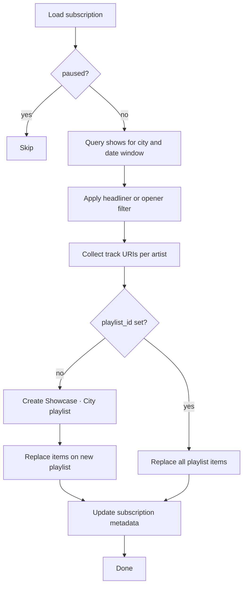

# Playlist sync specification

How the listener web app keeps a user’s **Showcase · {City}** playlist current without creating a new playlist on every run.

**Implementation:** [`showcase/playlist_creator/playlist_creator.py`](../showcase/playlist_creator/playlist_creator.py)

---

## Goals

1. **One playlist per user per city** — stable `playlist_id` stored in `user_subscriptions`.
2. **Replace, don’t append** — each sync sets the full track list via Spotify replace-items API.
3. **Deterministic ordering** — shows ordered by date; tracks grouped under each artist in that order.
4. **Safe to cron** — idempotent; failures recorded on subscription row.

---

## Actors

| Actor | Role |
|-------|------|
| **Sync job** | Batch process (cron). Loads active subscriptions, runs sync for each. |
| **PlaylistCreator** | Domain logic: filter shows → collect URIs → create or replace playlist. |
| **SpotifyIO** | Spotify Web API wrapper (`create_playlist`, `replace_items_in_playlist`, `get_top_tracks_from_artist_id`). |
| **Supabase** | Source of `shows` for catalog queries; sink for `last_synced_at` / status updates. |

---

## Sync algorithm



### Step 1 — Load subscription

Input from `user_subscriptions`:

- `spotify_user_id`, `refresh_token_encrypted`
- `city_id`, `playlist_id` (nullable)
- `tracks_per_artist` (default 2)
- `include_openers` (default false)
- `lookahead_days` (default 30)
- `paused`

If `paused`, exit without API calls.

### Step 2 — Query catalog

```sql
SELECT * FROM shows
WHERE city_id = :city_id
  AND show_start_time >= now()
  AND show_start_time <= now() + (:lookahead_days || ' days')::interval
ORDER BY show_start_time ASC;
```

### Step 2b — Personalize (taste filter and rank)

See [`docs/taste-personalization.md`](taste-personalization.md).

For each show, compute **relevance score** from:

- `language_filters` vs `shows.language_tags`
- Genre overlap: `genre_filters` / `taste_snapshot.genres` vs `shows.artist_genres`
- Artist similarity to user's top artists (Phase 3)
- `discovery_level` and `exclude_mainstream` vs `shows.artist_popularity`

Drop shows below `min_match_score`. Sort survivors by score desc, then `show_start_time`.

If no rows after taste filter: set `last_sync_status = 'no_shows'`, do **not** silently create empty playlist — user should widen taste filters.

### Step 3 — Filter show order

- `include_openers = false` → keep rows where `show_order = 'HEADLINER'`.
- `include_openers = true` → keep all rows.

If no rows: set `last_sync_status = 'no_shows'`, optionally clear playlist (replace with `[]`), exit.

### Step 4 — Collect track URIs

For each show (in order):

1. Skip if `artist_uri` is null (log warning).
2. Call Spotify artist top tracks; take first `tracks_per_artist` URIs.
3. Append to list; **dedupe** by URI while preserving first-seen order.

Output: `List[str]` of Spotify track URIs.

### Step 5 — Create or replace playlist

**First sync** (`playlist_id` is null):

1. Create private playlist: name `Showcase · {city.name}`.
2. Save `playlist_id` on subscription.
3. Replace items with collected URIs (or add if empty list).

**Subsequent syncs:**

1. Call `playlist_replace_items(playlist_id, track_uris)`.
2. Spotify replaces entire playlist contents in one request (max 100 tracks per request for replace — if catalog exceeds 100 tracks, use replace for first 100 then append chunks; v1 Toronto headliners unlikely to exceed 100).

### Step 6 — Update metadata

On success:

- `last_synced_at = now()`
- `last_sync_status = 'ok'`
- `last_sync_error = null`

On failure:

- `last_sync_status = 'error'`
- `last_sync_error = message` (truncated)
- Do not clear `playlist_id`

---

## Spotify API notes

| Operation | Spotipy method | Limit |
|-----------|----------------|-------|
| Create playlist | `user_playlist_create` | — |
| Replace all tracks | `playlist_replace_items` | 100 URIs per call |
| Add tracks | `playlist_add_items` | 100 URIs per chunk |

For playlists **> 100 tracks**: replace first 100, then `playlist_add_items` for remainder.

**Scopes required:** `playlist-modify-private` (and `user-read-private` for user id on create).

**Auth:** Per-user refresh token from web OAuth — sync job must instantiate Spotify client with that token, not the CLI’s `.spotify_token_cache`.

---

## Python API (this repo)

```python
from showcase.playlist_creator.playlist_creator import PlaylistCreator

creator = PlaylistCreator(sp_io)

# First-time or recurring sync
playlist_id = creator.sync_playlist(
    shows=shows,                    # List[Show] from catalog query
    playlist_id=existing_id_or_none,  # None → create
    playlist_name="Showcase · Toronto",
    num_tracks=2,
    show_order_select="headliner",  # or "all"
)
```

Helper for workers that already have catalog dicts:

```python
track_uris = creator.collect_track_uris_from_shows(shows, num_tracks=2, show_order_select="headliner")
sp_io.replace_items_in_playlist(playlist_id, track_uris)
```

---

## CLI vs web naming

| Context | Playlist name pattern |
|---------|------------------------|
| CLI ([`main.py`](../showcase/main.py)) | `showcase - from {date} - to {date} - {today}` (creates new each run) |
| Web app | `Showcase · Toronto` (stable; sync updates tracks only) |

The CLI can adopt `sync_playlist()` later with a `--playlist-id` flag for local testing.

---

## Error handling

| Condition | Behavior |
|-----------|----------|
| No shows in window | `last_sync_status = no_shows`; replace with empty or skip replace (product choice: prefer empty playlist) |
| Artist missing URI | Skip artist; continue sync |
| Spotify 401 | Mark subscription error; user must re-auth via web |
| Spotify rate limit | Retry with backoff; job-level queue |
| Invalid playlist_id | Clear `playlist_id` on subscription; next sync creates new playlist |

---

## Testing checklist

- [ ] `sync_playlist` with `playlist_id=None` creates playlist and returns id
- [ ] Second call with same id replaces tracks, does not create duplicate playlist
- [ ] Headliner filter excludes openers
- [ ] Dedupe: same artist twice in catalog → tracks appear once
- [ ] Empty shows → returns None or existing id without API error
- [ ] >100 tracks → chunked replace + add
