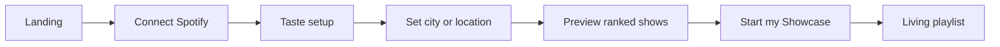
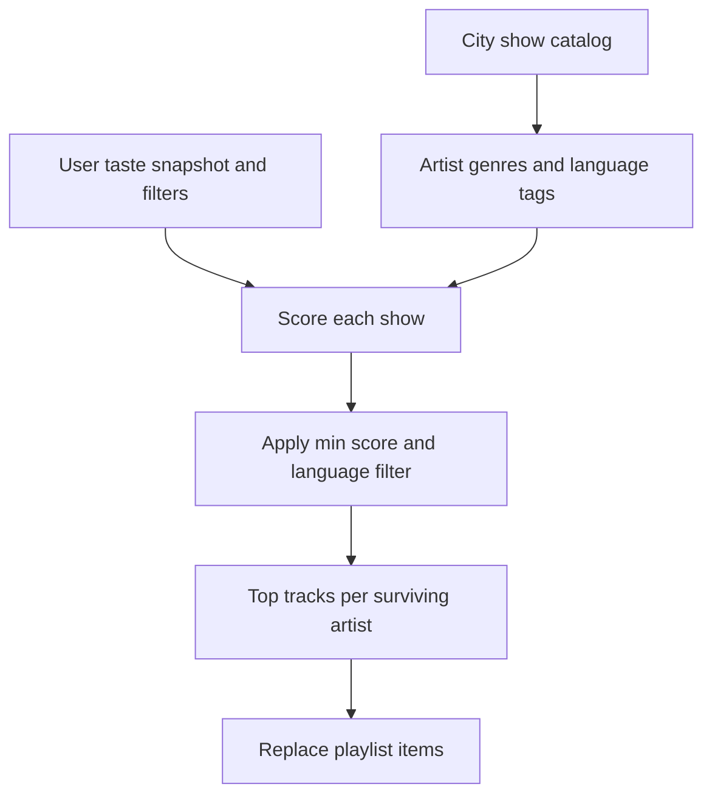

# Taste personalization

How Showcase learns what **you** care about before building a local-show playlist — so a CBC listener in Hong Kong does not get the same lineup as someone who only follows mainstream English pop.

**Related:** [listener-web-app.md](listener-web-app.md) · [playlist-sync.md](playlist-sync.md)

---

## Problem

Local show catalogs are **city-scoped**, not **person-scoped**. Every headliner in Toronto (or Hong Kong, when supported) lands in the same pool. Without personalization:

- The playlist reflects **venue programming**, not **listener taste**.
- Diaspora and niche listeners (e.g. Cantonese indie, Mandarin folk, UK jazz) see irrelevant acts promoted equally with acts they would actually attend.
- “Top tracks per artist” from Spotify global charts skew toward mainstream — not the user’s lane.

Personalization sits **after Spotify login, before preview and playlist creation**. It filters and ranks the catalog; it does not change ingest.

---

## Design principle

**Location picks the gig pool. Taste picks what rises to the top.**

| Input | Answers |
|-------|---------|
| City / geolocation | Which upcoming shows exist |
| Taste profile | Which of those shows matter to *this* user |

A user in Hong Kong with a Cantonese + English indie profile should see HK shows **ranked and filtered** toward matching artists, not a flat chronological list dominated by genres they never play.

---

## Updated user flow



### New step: Taste setup (step 2)

Shown immediately after Spotify connect, **before** city selection (taste is portable; city is not).

**Two layers — automatic signals + explicit filters.**

#### A. Automatic (Spotify library analysis)

On connect, request additional scopes (one-time consent):

- `user-library-read` — saved/liked tracks
- `user-top-read` — top artists & tracks (short + medium term)
- `user-read-recently-played` (optional, v2)

Build a **taste snapshot** (cached server-side, refreshed periodically):

1. Fetch top 50 artists (medium term) + sample of saved tracks.
2. Aggregate **genres** from artist objects (Spotify `artists[].genres`).
3. Infer **language lean** (see below).
4. Store snapshot on `user_subscriptions.taste_snapshot` (JSON).

Show a one-line summary: *“Mostly indie rock, Cantonese pop, and jazz — based on your Spotify.”*

User can **Accept** or **Adjust**.

#### B. Explicit filters (big, simple controls)

Primary UI: **language** toggles (multi-select, at least one required or “Any”):

| Label | Code | Notes |
|-------|------|-------|
| English | `en` | |
| Cantonese | `yue` | 粵語 |
| Mandarin | `cmn` | 普通話 |
| Japanese | `ja` | |
| Korean | `ko` | |
| Other | `other` | catch-all |

Secondary (collapsed “More taste”):

- **Genre chips** — pre-filled from Spotify snapshot, editable (indie, hip-hop, electronic, folk, metal, …).
- **Discovery slider** — “Stick to my lane” ←→ “Surprise me with local acts I’d never search for”.
- **Exclude mainstream** — deprioritize artists above a popularity threshold (Spotify `popularity` > 80).

Defaults: languages inferred from snapshot; user overrides win.

---

## Language inference

Spotify does not expose track language reliably. Use a **hybrid**:

1. **Artist genres** — e.g. `cantopop`, `mandopop`, `j-pop`, `k-pop` map directly.
2. **Track/script heuristic** — CJK characters in artist + track titles → `yue` / `cmn` / `ja` / `ko` (simple regex + optional LLM batch at ingest).
3. **User override** — explicit language filters always apply last.

At **ingest**, enrich each `shows` row:

- `artist_genres text[]` — from Spotify artist API when `artist_uri` is known.
- `language_tags text[]` — inferred tags (`en`, `yue`, …); nullable until enriched.

Re-ingest or lazy-enrich on first sync if missing.

---

## Preview changes

Preview is no longer a flat list. Each show gets a **relevance score** (0–100) from:

```
score = w1 * genre_overlap
      + w2 * language_match
      + w3 * artist_similarity_to_top_artists
      + w4 * recency_boost
      - w5 * mainstream_penalty (if enabled)
```

UI:

- Sort by score descending (date as tiebreaker).
- Dim or hide shows below threshold (e.g. score < 30) with “Show all local acts” expander.
- Badge on cards: **Strong match** / **Worth a look** / **Outside your usual lane** (only if discovery slider allows).

User always sees *why*: “Because you listen to [Artist X]” or “Cantonese · indie”.

---

## Playlist sync changes

Sync uses the same scoring pipeline as preview. Only shows passing the user’s minimum score (and language filter) contribute tracks.



If **no shows pass** the filter:

- Do not create an empty playlist silently.
- Surface: “No upcoming shows match your taste in {city}. Widen languages or discovery?” with link back to taste setup.

See [playlist-sync.md](playlist-sync.md) — Personalization section.

---

## Spotify scopes (additions)

| Scope | Purpose |
|-------|---------|
| `user-library-read` | Liked/saved tracks for taste snapshot |
| `user-top-read` | Top artists and tracks |
| `user-read-recently-played` | Optional; fresher signals (v2) |

Existing: `playlist-modify-private`, `user-read-private`, `user-read-email`.

---

## Data model additions

Migration: [`supabase/migrations/002_taste_personalization.sql`](../supabase/migrations/002_taste_personalization.sql)

### `user_subscriptions` (new columns)

| Column | Type | Notes |
|--------|------|-------|
| `language_filters` | `text[]` | e.g. `{yue, en}` |
| `genre_filters` | `text[]` | optional explicit genres |
| `discovery_level` | `int` | 0 = stick to lane, 100 = max discovery |
| `exclude_mainstream` | `boolean` | default false |
| `min_match_score` | `int` | default 30 |
| `taste_snapshot` | `jsonb` | cached Spotify-derived profile |
| `taste_updated_at` | `timestamptz` | |

### `shows` (new columns)

| Column | Type | Notes |
|--------|------|-------|
| `artist_genres` | `text[]` | from Spotify at ingest |
| `language_tags` | `text[]` | inferred `en`, `yue`, `cmn`, … |
| `artist_popularity` | `int` | Spotify 0–100 |

---

## Example: CBC in Hong Kong

**Signals from Spotify:** top artists include My Little Airport, Eason Chan, Khruangbin; saved tracks mix Cantonese indie + English psych.

**Inferred profile:** languages `yue`, `en`; genres `indie`, `cantopop`, `psychedelic`.

**User confirms:** Cantonese + English checked; discovery slider mid; exclude mainstream off.

**Visiting Toronto (travel) or future HK catalog:**

- Show for a generic EDM festival headliner → low score, hidden by default.
- Show for a Cantopop revival act or English indie band similar to Khruangbin → top of preview, tracks in playlist.

Same city catalog, different playlist for different listeners.

---

## Implementation phases

### Phase 1 — Explicit filters only (fast)

- Taste step UI: language toggles + genre chips (manual, no library read).
- Filter preview/sync by `language_tags` on shows (once ingest enriches them).
- No scoring yet — binary include/exclude.

### Phase 2 — Spotify snapshot

- Add scopes; build `taste_snapshot` on connect.
- Pre-fill language + genre chips from snapshot.
- Genre overlap scoring in preview sort.

### Phase 3 — Full ranking

- Artist similarity (Spotify Related Artists or embed distance).
- Discovery slider + mainstream penalty.
- “Why this show” explanations on cards.

---

## Out of scope (for now)

- Collaborative filtering across users (“people like you”).
- LLM-generated taste paragraphs.
- Per-show RSVP or ticket intent.

---

## Open questions

1. **Hong Kong ingest timeline** — taste UI ships before HK catalog; HK users may use taste profile while browsing Toronto travel shows or waitlist.
2. **Language tagging accuracy** — start with genre proxies; improve with title heuristics + manual artist overrides later.
3. **Privacy copy** — clear consent: “We read your top artists and likes to rank local shows; we never post to Spotify.”
